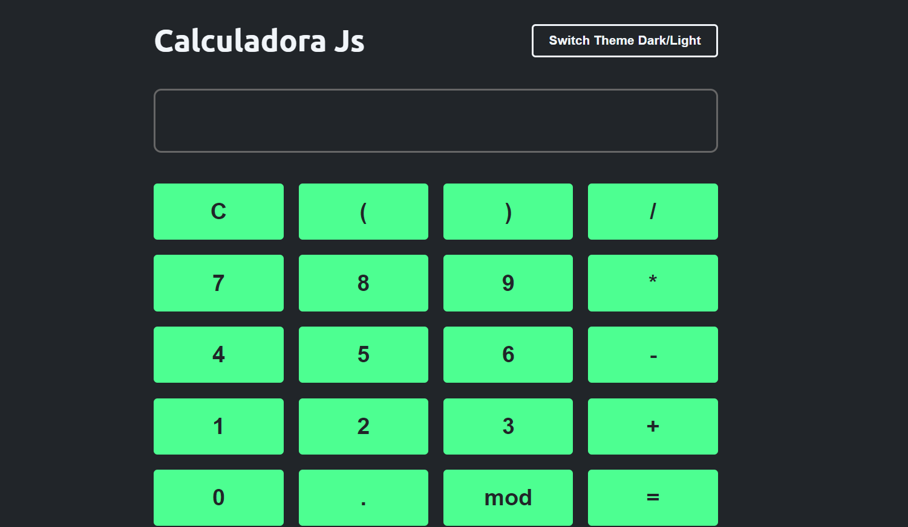

## Desenvolvido por [Arthur Mendes Cunha](https://github.com/mendesarthur)

# Calculadora JavaScript

### A calculadora realiza **soma**, **subtração**, **multiplicação** e **divisão**.

# Iniciar🚀

 Para inciar o projeto, é so abrir o arquivo `index.html` no seu navegador preferido.
